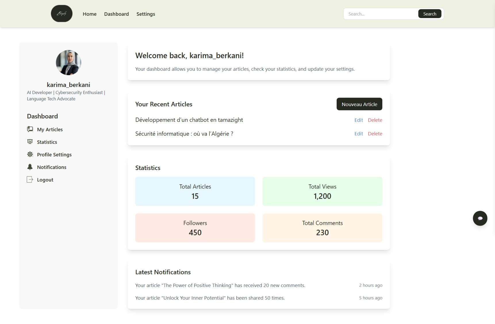
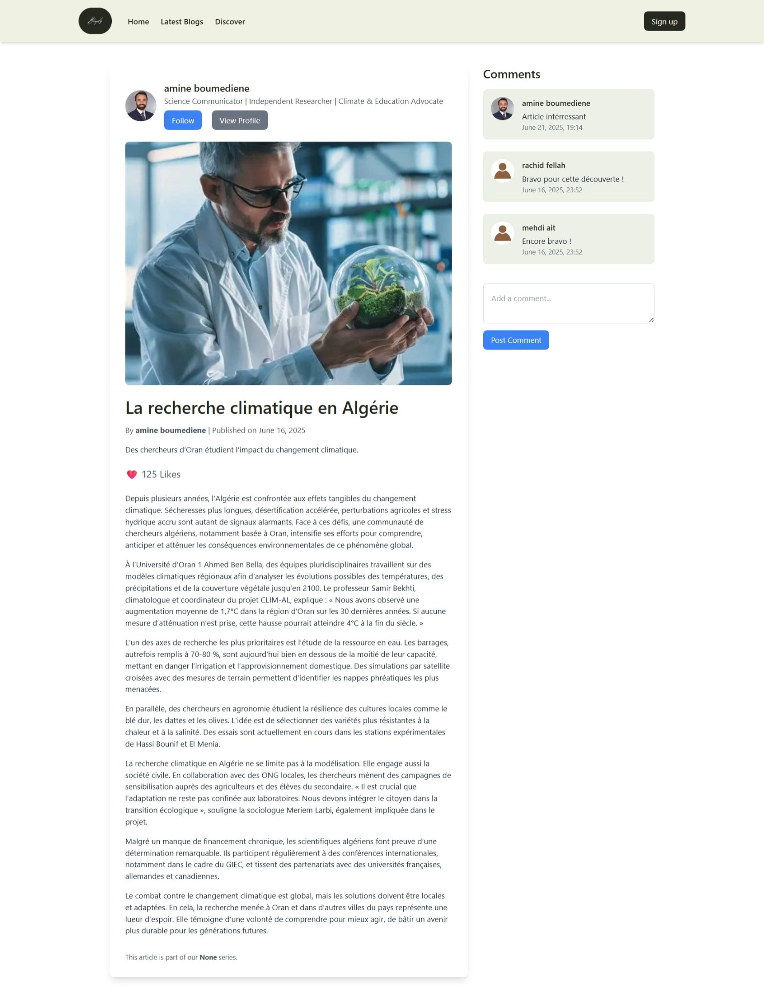
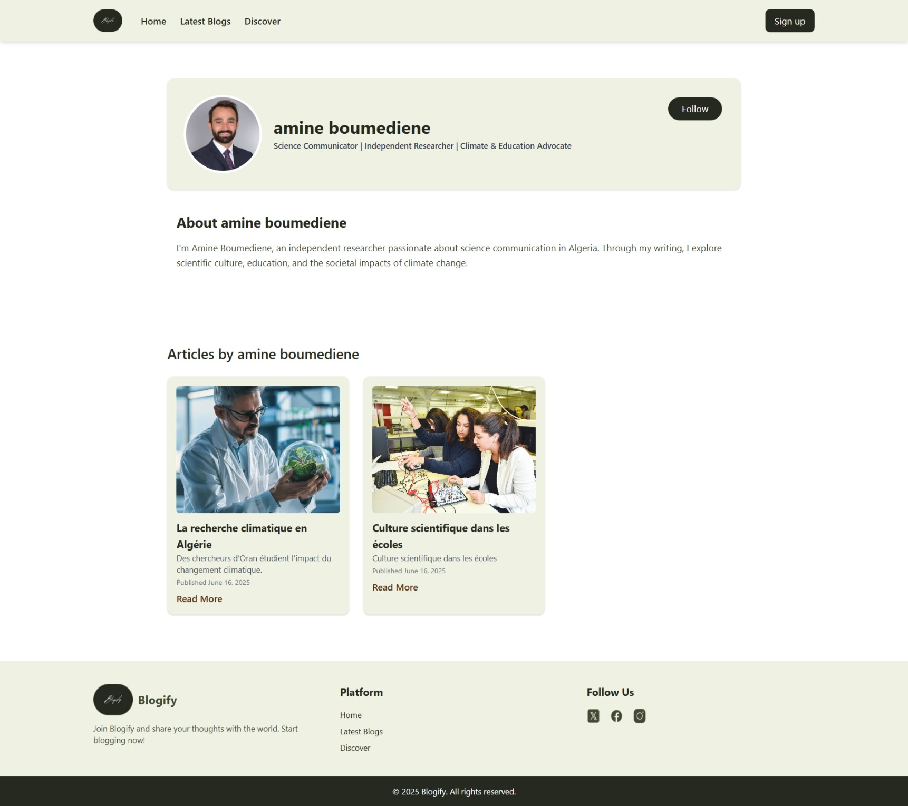

# 📝 BlogSphère

Bienvenue sur **BlogSphère**, une plateforme de blogging moderne permettant aux auteurs de créer, gérer et publier leurs articles facilement via une interface claire, responsive et intuitive.

---

## 🚀 Fonctionnalités principales

- ✍️ Création, modification et suppression d’articles  
- 👤 Tableau de bord personnalisé pour chaque auteur  
- 🔐 Authentification sécurisée (inscription, connexion, mot de passe)  
- 🌐 Intégration frontend via le système de templates Django  
- 📱 Interface responsive (HTML + CSS uniquement, sans framework JS)

---

## 📸 Aperçu de l'application

| 🏠 Page d’accueil | 📊 Dashboard Auteur | 📄 Article | 👤 Profil Auteur |
|------------------|---------------------|------------|------------------|
|  |  |  |  |

---

### 🔐 Authentification

| Inscription | Connexion | Mot de passe oublié |
|-------------|-----------|----------------------|
|  |  |  |

---
---

## 🛠️ Technologies utilisées

- **Backend** : [Django](https://www.djangoproject.com/) (Python)  
- **Frontend** : HTML & CSS (intégré via le moteur de templates Django)  
- **Base de données** : MySQL  
- **Autres** : Tailwind CSS (CDN) pour un style moderne rapide

---

## ⚙️ Lancer l'application en local

### 1. Cloner le projet

```bash
git clone https://github.com/SaraBarkat/Blogify.git
cd Blogify
```

### 2. Configuration de l’environnement

```bash
python -m venv env
source env/bin/activate  # Sous Windows : env\Scripts\activate
pip install -r requirements.txt
```

### 3. Initialiser la base de données

```bash
python manage.py migrate
```

### 4. Lancer le serveur

```bash
python manage.py runserver
```

### 5. Accéder à l’application

Ouvrir [http://127.0.0.1:8000](http://127.0.0.1:8000) dans votre navigateur.

---

## ✅ À savoir

- Tous les templates HTML sont intégrés via Django (`templates/`)  
- Aucun framework JavaScript externe n’est utilisé  
- L’interface est entièrement responsive grâce à Tailwind CSS CDN  
- Compatible desktop, tablette et mobile

---
