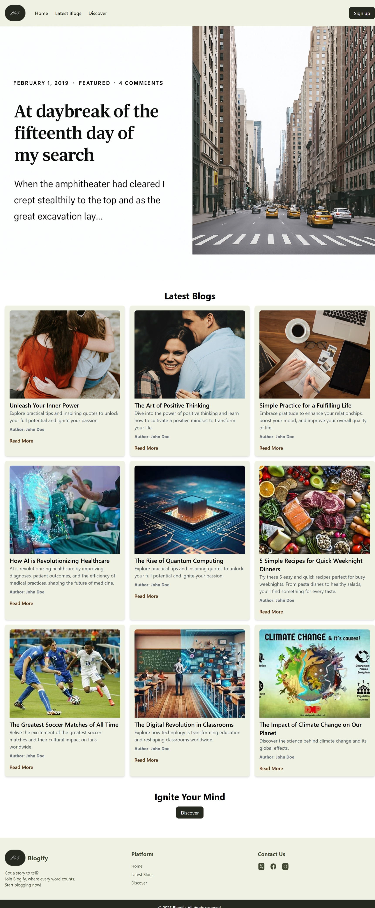
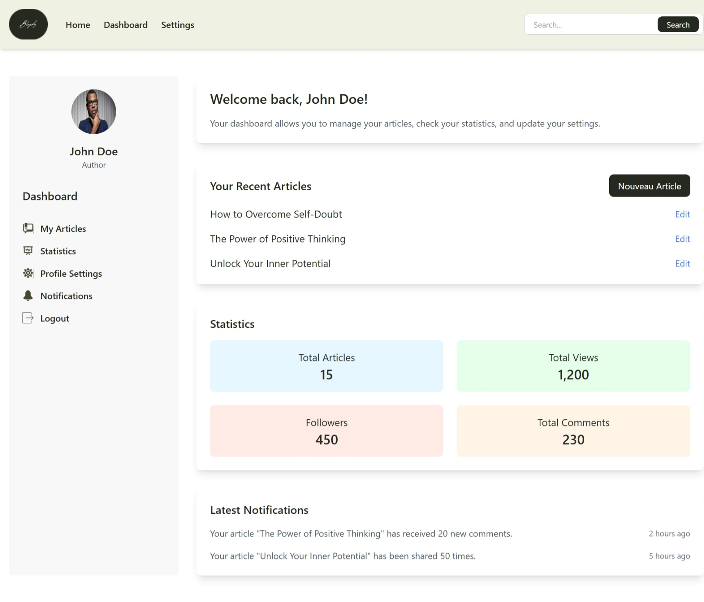

# 📝 Blogify

Bienvenue sur **Blogify**, une plateforme de blogging moderne permettant aux auteurs de créer, gérer et publier leurs articles facilement, avec une interface claire et intuitive.

---

## 🚀 Fonctionnalités principales

- Publication d'articles avec éditeur simple
- Tableau de bord pour les auteurs
- Authentification sécurisée
- Interface responsive pour tous les appareils

---

## 📸 Aperçu de l'application

### 🏠 Landing Page

  

---

### 📊 Tableau de bord Auteur

  

---

### 🔐 Authentification

| Inscription | Connexion | Mot de passe oublié |
|-------------|-----------|----------------------|
|  |  |  |

---

## 🛠️ Technologies utilisées

- **Frontend** : HTML, CSS, JavaScript  
- **Backend** : Django  
- **Base de données** : MySQL

---

## 📁 Structure du projet

---

## 🚀 Lancer l'application en local

### 1. Cloner le dépôt

git clone https://github.com/SaraBarkat/Blogify.git
cd blogify

### 2. Installation Backend (Django)

cd backend
python -m venv env
source env/bin/activate  # ou env\Scripts\activate sous Windows
pip install -r requirements.txt
python manage.py migrate
python manage.py runserver

### 3. Ouvrir le Frontend
Ouvrir frontend/LandingPage/index.html dans votre navigateur .